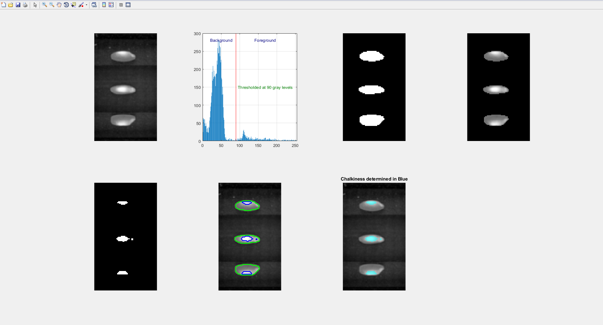

# Chalkiness_segmentation_using_histogram

This is the MATLAB script to classify the rice grains based on it's chalkiness using simple histogram based segmentation.

The input rice grains image should be recorded in different views so as to classify accurately.

In the beginning, a histogram isnplotted to explore the image. Then, a cut-off is set to remove the background noise from the region of interest.

Later, another histogram of noise-removed-image is explored and a cut-off is set to get the white spot in the image which is nothing but chalkiness.

Please write me if you need more information.

